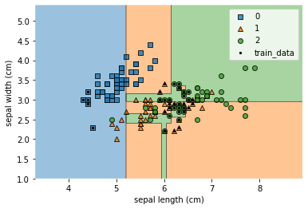
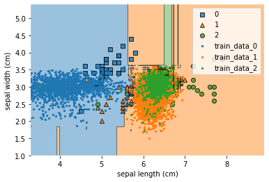
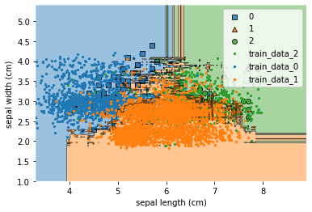
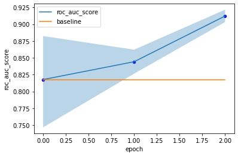

# human_ctgan

SDV's CTGAN(L.Xu et al. 2019) with HumanGAN(K.Fujii et al. 2020) for Human-in-the-Loop

The result of the sample code(sample_of_iteration.py) can be read the below.

## Summary of the sample data (iris)

<div>
<table>
  <thead>
    <tr style="text-align: right;">
      <th></th>
      <th>sepal length (cm)</th>
      <th>sepal width (cm)</th>
      <th>target</th>
    </tr>
  </thead>
  <tbody>
    <tr>
      <th>count</th>
      <td>150.000000</td>
      <td>150.000000</td>
      <td>150.000000</td>
    </tr>
    <tr>
      <th>mean</th>
      <td>5.843333</td>
      <td>3.057333</td>
      <td>1.000000</td>
    </tr>
    <tr>
      <th>std</th>
      <td>0.828066</td>
      <td>0.435866</td>
      <td>0.819232</td>
    </tr>
    <tr>
      <th>min</th>
      <td>4.300000</td>
      <td>2.000000</td>
      <td>0.000000</td>
    </tr>
    <tr>
      <th>25%</th>
      <td>5.100000</td>
      <td>2.800000</td>
      <td>0.000000</td>
    </tr>
    <tr>
      <th>50%</th>
      <td>5.800000</td>
      <td>3.000000</td>
      <td>1.000000</td>
    </tr>
    <tr>
      <th>75%</th>
      <td>6.400000</td>
      <td>3.300000</td>
      <td>2.000000</td>
    </tr>
    <tr>
      <th>max</th>
      <td>7.900000</td>
      <td>4.400000</td>
      <td>2.000000</td>
    </tr>
  </tbody>
</table>
</div>

## Summary of the train data

The train data are biased.

<div>
<table>
  <thead>
    <tr style="text-align: right;">
      <th></th>
      <th>sepal length (cm)</th>
      <th>sepal width (cm)</th>
      <th>target</th>
    </tr>
  </thead>
  <tbody>
    <tr>
      <th>count</th>
      <td>45.000000</td>
      <td>45.000000</td>
      <td>45.000000</td>
    </tr>
    <tr>
      <th>mean</th>
      <td>6.048889</td>
      <td>2.888889</td>
      <td>1.377778</td>
    </tr>
    <tr>
      <th>std</th>
      <td>0.618878</td>
      <td>0.317821</td>
      <td>0.683869</td>
    </tr>
    <tr>
      <th>min</th>
      <td>4.300000</td>
      <td>2.200000</td>
      <td>0.000000</td>
    </tr>
    <tr>
      <th>25%</th>
      <td>6.000000</td>
      <td>2.800000</td>
      <td>1.000000</td>
    </tr>
    <tr>
      <th>50%</th>
      <td>6.300000</td>
      <td>2.900000</td>
      <td>1.000000</td>
    </tr>
    <tr>
      <th>75%</th>
      <td>6.400000</td>
      <td>3.000000</td>
      <td>2.000000</td>
    </tr>
    <tr>
      <th>max</th>
      <td>6.600000</td>
      <td>3.400000</td>
      <td>2.000000</td>
    </tr>
  </tbody>
</table>
</div>

## Training only the original data

Because the classification model trained highly biased data, The ROC AUC score and the decision regions are not very correct.

- ROC AUC

    ```python
    print('roc_auc_score:', original_roc_auc_score)
    # roc_auc_score: 0.8235333333333333
    ```

- decision region

    


## Initial CTGAN training (with no human feedbacks)

Adding synthesized data generated only by CTGAN to make the classification model more accurate.

- code of the CTGAN training and synthesized data generation

    ```python
    seed_tuple = create_seed_tuple()

    hctgan = HCTGANSynthesizer(sample_size_of_feedback_data=SAMPLE_SIZE_OF_FEEDBACK_DATA,
                            perturbation_per_feedback_datum=PERTURBATION_PER_FEEDBACK_DATUM,
                            perturbation_sigma=PERTURBATION_SIGMA,
                            epochs=CTGAN_FEEDBACK_EPOCHS)
    hctgan.random_states = seed_tuple
    hctgan.fit(df_train,
            discrete_columns=DISCRETE_COLUMNS)
    hctgan.random_states = seed_tuple
    first_synthed_df = hctgan.sample(SAMPLE_SIZE_OF_SYNTHESIZED_DATA)
    new_train_df = pd.concat([train_df, first_synthed_df])
    ```

Even adding synthesized data to the training data, nothing seems to be corrected.

- ROC AUC

    ```python
    print('roc_auc_score:', original_and_ctgan_roc_auc_score)
    roc_auc_score: 0.817612
    ```

- decision region

    

## Human-CTGAN Training

The code below runs the Human-CTGAN training twice.

```python
def iterate_feedbacks(hctgan,
                      df_train,
                      roc_auc_score_list,
                      roc_auc_score_lower_list,
                      roc_auc_score_upper_list,
                      sample_size_of_synthesized_data,
                      sample_size_of_feedback_data,
                      perturbation_per_feedback_datum,
                      perturbation_sigma,
                      hctgan_file_path,
                      feedback_csv_path,
                      feedback_colname,
                      seed_tuple,
                      target_colname='target',
                      discrete_columns=DISCRETE_COLUMNS,
                      start_n=1,
                      iter_n=2,
                      bootstrap_iter_n=BOOTSTRAP_ITER_N,
                      training_method='HumanGAN',
                      use_perturbation_when_active_learning=USE_PERTURBATION_WHEN_ACTIVE_LEARNING):
    """simulate Human-in-the-Loop processes of Human-CTGAN
    """
    current_sigma = perturbation_sigma
    end_n = start_n + iter_n

    hctgan.save(path=hctgan_file_path)
    hctgan.set_device(torch.device('cpu'))
    copyed_hctgan: HCTGANSynthesizer = HCTGANSynthesizer.load(
        path=hctgan_file_path)

    df_feedback_list = []
    for i in range(start_n, end_n):
        is_current_sigma_halfed = False
        if i != 1 and i % 1 == 0:
            current_sigma /= 2
            is_current_sigma_halfed = True

        copyed_hctgan.save(path=hctgan_file_path)

        # [1ST. PROCESS] create feedback data
        if training_method == 'HumanGAN' or use_perturbation_when_active_learning:
            copyed_hctgan.random_states = seed_tuple
            copyed_hctgan.create_feedback_data_csv(csv_path=feedback_csv_path,
                                                   sample_size_of_feedback_data=sample_size_of_feedback_data,
                                                   perturbation_per_feedback_datum=perturbation_per_feedback_datum,
                                                   perturbation_sigma=current_sigma,
                                                   target_colname=feedback_colname)
            # NOTE: Originally, a CSV file would be read here, with human feedback
            # of the data evaluation values (i.e. probability of authenticity).
            # However, since that is not available now, the evaluation values
            # obtained by the classifier (e.g. KNN) are given afterwards.
            feedback_df = pd.read_csv(feedback_csv_path)
            data_for_feedback_orig = feedback_df.drop(columns=feedback_colname)
        elif training_method == 'ActiveLearning':
            copyed_hctgan.random_states = seed_tuple
            feedback_df = copyed_hctgan.sample(n=sample_size_of_feedback_data)
            data_for_feedback_orig = feedback_df.copy()
        else:
            raise ValueError('Unsupported training_mode:', training_method)

        # NOTE: Adding the data evaluation values described above.
        feedback_probs = feedback_function(data_for_feedback_orig)
        feedback_df[feedback_colname] = feedback_probs
        feedback_df.to_csv(
            f'./output/debug_feedbacks_iter_{i}.csv', index=False)
        if training_method == 'ActiveLearning':
            feedback_df = feedback_df[feedback_df[feedback_colname] >= 0.6]
            df_feedback_list.append(feedback_df)

        # [2ND. PROCESS] create feedback datarefit using feedback data
        # NOTE: This process is usually done some days after the feedback generation.
        # To simulate this, the Human-CTGAN model is read back from the file
        # once it has been saved.
        copyed_hctgan: HCTGANSynthesizer = HCTGANSynthesizer.load(
            path=hctgan_file_path)
        if is_current_sigma_halfed:
            copyed_hctgan.perturbation_sigma = current_sigma

        if training_method == 'HumanGAN':
            # NOTE: fit_to_feedback method performs a back propagation logic with the feedback data.
            copyed_hctgan.random_states = seed_tuple
            copyed_hctgan.fit_to_feedback(data_for_feedback_orig,
                                          feedback_probs)
        elif training_method == 'ActiveLearning':
            # NOTE: HCTGAN refits the CTGAN model with the feedback data.
            copyed_hctgan.fit(pd.concat([df_train,
                              pd.concat(df_feedback_list).drop(columns=feedback_colname)]),
                              discrete_columns=discrete_columns)

        print(f'=== i {i: 03d} ===')
        copyed_hctgan.random_states = seed_tuple
        intermediate_roc_auc_score, score_lower, score_upper = calc_conf_interval_of_auc_by_bootstrapping(copyed_hctgan,
                                                                                                          df_train,
                                                                                                          seed_tuple,
                                                                                                          sample_size_of_synthesized_data,
                                                                                                          target_colname,
                                                                                                          iter_n=bootstrap_iter_n,
                                                                                                          percentage_of_confidence_interval=0.95)
        print('roc_auc_score:', intermediate_roc_auc_score)
        roc_auc_score_list.append(intermediate_roc_auc_score)
        roc_auc_score_lower_list.append(score_lower)
        roc_auc_score_upper_list.append(score_upper)

    return copyed_hctgan
```

### Feedback function settings

In practice, it is necessary for humans to provide feedback on the synthesized data.  
Feedback values must take a value between 0 and 1.  
The more data seem to be authentic, the closer to 1 you should set the values.

But in the sample code, feedbacks are given by the function instead of a human.

```python
feedback_function = get_feedback_function_by_knn_and_rule_base(df)
```

In the table below, you can see how the feedback data are.  
In the actual case, humans must fill the "feedback" column with values between 0 and 1.

|sepal length (cm)|sepal width (cm)|target|feedback|
|-----------------|----------------|------|--------|
|6.48274780724834|3.77748146236847|2|0.8|
|5.65642825020731|2.65161707453976|1|0.6|
|6.47100701527128|3.77748146236847|2|0.8|

### Result of Human-CTGAN

Thanks to the feedbacks by the function, the distributions of the synthesized data are much closer to the true one.  
However, the feedbacks are not perfect because it cannot correctly evaluate data outside of the original value range.  
It is why some data are located in odd positions.

So, even when humans give feedbacks, you should consider how the feedbacks you give should be modified based on the results of the active learnings or the back propagation processes.



### ROC AUC score in each epoch

Epoch 0 is the result of the classification model learning the training data and first CTGAN sythesized data.  
The blue band on the graph represents the bootstrap confidence interval (95% CI) for AUC ROC scores.


